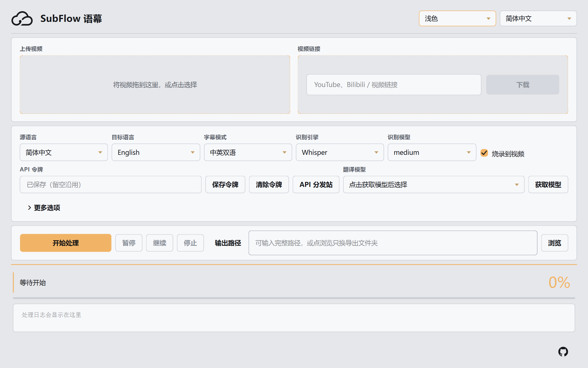
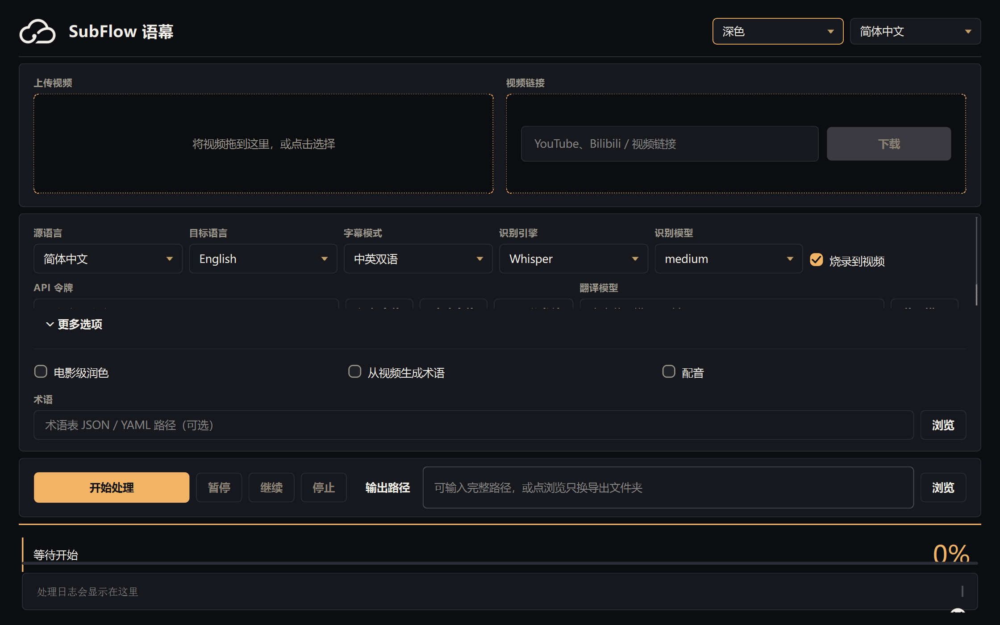

# SubFlow 语幕

**新一代 AI 视频语音识别、自动翻译、字幕生成工具**

深度云创科技出品。本地识别语音，云端翻译成片。拖入视频或粘贴 YouTube / Bilibili 链接，即可得到双语字幕、烧录成片，以及可选配音。

当前源码版本 **1.3.6**。[GitHub Releases](https://github.com/crazymsn/SubFlow/releases/latest) · [Docker Compose](#docker) · [API 分发站](https://api.meding.site)



## 能做什么

| 能力 | 说明 |
| --- | --- |
| 语音识别 | 本机 Whisper / WhisperX，不把原片上传到识别服务 |
| 链接入库 | YouTube、Bilibili 一键下载最高清；优先原声音轨，避免英文自动配音 |
| 自动翻译 | [meding](https://api.meding.site) OpenAI 兼容接口；获取模型时自动屏蔽 BAAI / 智源条目 |
| 中英字幕 | 中英 / 英中各 **1 行**，居中叠在安全区内；超长句缩放，不出画 |
| 简繁 | 目标语种为简体时，中文轨一律转为简体（Whisper 默认繁体也会转） |
| 烧录颜色 | 中英字幕颜色可自选；只改颜色会重渲 ASS 并重烧，不重跑识别 |
| 成片导出 | 烧录 MP4，同时写出 SRT / ASS |
| 配音 | 内置 GPT-SoVITS 克隆音色；启动客户端自动拉起本机服务 |
| 三种入口 | Windows / macOS 桌面客户端、Python CLI、Docker 镜像 |

界面提供简体中文、繁体中文、English、日本語、Español、Русский、Français、Deutsch。默认界面为简体中文。



## 字幕怎么对应

三个控件职责分开，互不覆盖：

| 控件 | 只管 |
| --- | --- |
| 源语种 | 识别 / Whisper 语言 |
| 目标语种 | 配音语种，以及中文轨的简体 / 繁体 |
| 字幕样式 | 画面上出现哪些语言、谁在上谁在下 |

| 字幕样式 | 目标语种 | 画面 |
| --- | --- | --- |
| 中英字幕 | 简体中文 | 简体 1 行在上，英文 1 行在下 |
| 中英字幕 | 繁體中文 | 繁体 1 行在上，英文 1 行在下 |
| 英中字幕 | 简体中文 | 英文 1 行在上，简体 1 行在下 |
| 单语「简体中文」 | — | 只烧简体 1 行 |
| 单语 English | — | 只烧英文 1 行 |

源语种和目标语种都选简体、字幕选中英：中文原声 + 简体/英文字幕，不会自动配成英文。

中文原视频选择简体中文或繁體中文目标时始终保留原声，配音开关不会覆盖此规则。简繁转换只影响字幕；英文等跨语种目标才调用 GPT-SoVITS。

## 开始使用

1. 打开 [Releases](https://github.com/crazymsn/SubFlow/releases/latest)，下载 对应架构的 `SubFlow-Windows-x64.zip`、`SubFlow-macOS-arm64.zip` 或 `SubFlow-macOS-x64.zip`（未发布的构建在 Actions 工件中）。
2. Windows：**整夹解压**，进入 `SubFlow` 目录，双击 `SubFlow.exe`。不要只拷贝 exe。
3. macOS：解压后把 `SubFlow.app` 拖到「应用程序」；若提示未验证开发者，按住 Control 点击后选择打开。
4. 到 [API 分发站](https://api.meding.site) 领取令牌，在客户端保存，再点「获取模型」。
5. 拖入视频，或粘贴链接后下载。
6. 选好源语言、目标语言、字幕样式，点击「开始处理」。

客户端自带 FFmpeg 和安装器，首次启动自动在用户目录准备 Python 3.11、推理依赖和 GPT-SoVITS 模型（Apple M 系列默认启用 MPS GPU，其余平台默认 CPU）；首次识别再下载所选 Whisper 权重。无需预装 Python、CUDA 或编译器。首次需要联网并预留约 15–20 GB 空间；后续复用缓存。Apple Silicon 客户端通过 PyTorch MPS 使用 Apple GPU；无需 CUDA。无显卡也能识别、配音和导出，CPU 上建议先用 tiny/base/small 测试短片，速度取决于设备。详细步骤见 [桌面客户端](docs/desktop.md)。

## 从源码运行

```bash
# 建议 Python 3.11+
pip install -e ".[gui,dev]"
subflow doctor
subflow config set-api-key
subflow models
subflow gui
```

命令行一次跑完：

```bash
subflow run demo.mp4 -o demo-中英字幕.mp4 --model gpt-4o-mini
subflow run --url "https://www.bilibili.com/video/BVxxxx" -o out.mp4
subflow run demo.mp4 -o out.mp4 --zh-color "#FFD400" --en-color "#F2F2F2"
```

兼容旧命令 `bilingual-sub`。

## Docker

Compose 从当前源码自动构建 CPU 镜像，安装 FFmpeg、识别和配音环境。宿主机仅需安装 Docker 和 Compose。

```bash
cp .env.example .env
# 编辑 .env，填入 SUBFLOW_API_KEY（不要提交 .env）
docker compose build
docker compose run --rm subflow doctor
docker compose run --rm subflow models
docker compose run --rm subflow run /data/demo.mp4 -o /data/demo-中英字幕.mp4
```

输入输出位于 `./data`，模型使用命名卷持久缓存。首次跨语种配音会自动下载模型；重复运行无需重装。旧 Docker Hub 镜像不代表本次源码构建。

## 流水线

```
视频 / 链接 → 抽音 → 静音切句 → Whisper / WhisperX
    → 整理字幕 → 术语 → 翻译（可选润色）→ 简繁转换
    → ASS / SRT（中英各 1 行）→ 烧录 MP4 → 可选配音
```

暂停、继续、停止可在桌面客户端操作。同片只换输出路径或只改字幕颜色时，不会重跑识别。

## 文档

| 文档 | 内容 |
| --- | --- |
| [桌面客户端](docs/desktop.md) | 安装、启动、字幕颜色、界面字段 |
| [安装](docs/install.md) | Docker Compose / Python / 从源码打包 |
| [API 令牌](docs/api-key.md) | 本机存储、轮换、多用户隔离 |
| [故障排除](docs/troubleshooting.md) | 识别、翻译、烧录、下载、客户端 |
| [架构](docs/architecture.md) | 模块边界与 JobConfig |
| [meding 契约](docs/api-meding.md) | 翻译 API 的固定地址与错误码 |
| [社区版本验收](docs/community-qa-2026-09-05.md) | Windows / Mac / Docker 构建结果与首次安装验证 |
| [Apple GPU 验证](docs/apple-gpu-qa-2026-09-05.md) | MPS 自动环境、兼容修复与实机验收范围 |
| [全量代码审查进度](docs/code-audit-status.md) | 已修复问题、回归证据与尚未完成的审查范围 |
| [贡献](CONTRIBUTING.md) | 分支、测试与约束 |

## 系统要求

- Windows 10/11 x64；macOS 14+（Apple Silicon）或 15+（Intel）；也支持 Python 3.11+ / Docker
- 客户端内置 FFmpeg / ffprobe；源码运行需自行安装含字幕渲染支持的 FFmpeg
- 建议 16 GB 内存；内存较少时先选 tiny/base 识别模型，避免同时处理多个任务
- 可选 NVIDIA GPU（`cuda` 额外依赖，不打进官方客户端）
- 需要翻译时，用户自备 meding API 令牌；中文单语保留原声不需要翻译令牌

若客户端提示缺少 Qt / VCRUNTIME DLL，安装 [Microsoft Visual C++ 2015–2022 Redistributable (x64)](https://learn.microsoft.com/en-us/cpp/windows/latest-supported-vc-redist)。

## 安全

- API 令牌只写本机凭据库，工具不上传、不汇聚、不共享
- 仓库与发布包**不含** API Key、Cookie、`.env`
- 日志自动脱敏，异常栈不含 Authorization
- 识别在本机完成；翻译请求只发字幕文本，不发原片
- Docker 镜像不含令牌；用 `.env` 注入

## License

MIT — 深度云创科技。字幕字体许可见 [LICENSE-fonts.txt](LICENSE-fonts.txt)。
