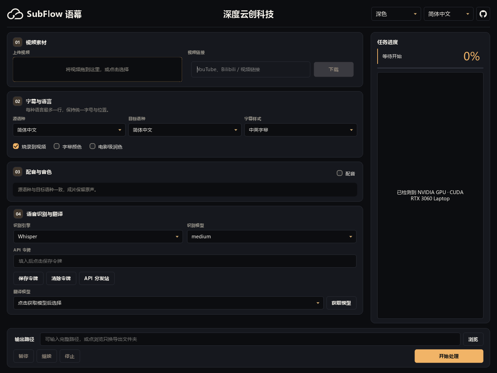

# SubFlow 语幕

本地语音识别、字幕翻译、视频烧录与多语种配音。支持 Windows、Apple M 系列 / Intel Mac，以及 Docker Compose。

**版本 1.3.60** · [下载完整客户端](https://github.com/crazymsn/SubFlow/releases/latest) · [Docker Hub](https://hub.docker.com/r/crazymsn/subflow) · [使用文档](docs/README.md) · [更新记录](CHANGELOG.md)



以上为 1.3.60 实际 Qt 界面，使用空白配置截图，未启动视频任务。顶栏中央的[深度云创科技](https://nav.meding.site)保留超链接；语音识别与翻译设置始终展开。浅色界面与操作说明见[工作区指南](docs/workspace.md)。

## 选择运行方式

| 平台 | 下载 / 部署 | 计算设备 |
| --- | --- | --- |
| Windows 10/11 x64 | Release 中全部 `SubFlow-Windows-x64.7z.*` 分卷 | 优先 NVIDIA CUDA，无可用 GPU 时使用 CPU；AMD / Intel 显卡使用 CPU |
| Apple M 系列，macOS 14+ | 全部 `SubFlow-macOS-arm64.7z.*` 分卷 | 原生 Whisper、Qwen、GPT-SoVITS 优先 MPS；WhisperX 使用 CPU |
| Intel Mac，macOS 15+ | 全部 `SubFlow-macOS-x64.7z.*` 分卷 | CPU |
| Linux / NAS / Docker Desktop | `crazymsn/subflow:latest`，见 [Compose 指南](docs/docker.md) | Linux amd64 / arm64 CPU；Mac Docker 不支持 MPS |

**完整客户端内置三种配音模式的模型，以及 Whisper、WhisperX、Qwen、GPT-SoVITS 四套 Python 运行环境。** 用户无需自行安装 Python、PyTorch 或 CUDA Toolkit；NVIDIA GPU 仍需系统显卡驱动。配音首次加载是本地校验与加载，不是再次下载。

识别模型及 WhisperX 对齐模型按所选型号下载；翻译 API 和视频链接下载仍需联网。Docker 镜像预装运行依赖，模型首次使用下载到持久化卷，与桌面完整包不同。详见[环境覆盖](docs/runtime-coverage.md)。

## 下载与开始

1. 从 [Release](https://github.com/crazymsn/SubFlow/releases/latest) 下载**同一平台全部分卷**及 `SHA256SUMS`，放在同一目录。校验后用支持 7z 分卷的工具从 `.7z.001` 解压；不要单独打开后续分卷。
2. Windows 启动 `SubFlow/SubFlow.exe`；Mac 将 `SubFlow.app` 放入「应用程序」。保留完整目录，勿只复制 EXE 或删除 `offline`。Mac 包未做 Apple 开发者公证，安装说明见[桌面指南](docs/desktop.md)。
3. 拖入视频，设置源语种、目标语种与字幕样式。在「语音识别与翻译」选择识别模型；需要翻译时填写自己的 [API 令牌](docs/api-key.md)。
4. 跨语种配音默认使用 Qwen 标准音色；选择音色并试听。输出路径使用新的文件名，点击「开始处理」。
5. 翻译中途失败或缺句时，修正令牌 / 网络 / 模型设置后点击「继续」，在缓存有效时从翻译阶段恢复。

下载包和解压目录会同时占空间，还需为识别模型、原片、输出和工作文件留空间。CPU / 8 GB 内存设备建议先用短片与 Whisper tiny / base，逐项确认速度和内存占用。完整包详情见[离线配音指南](docs/offline-voices.md)。

## 字幕和配音

- **字幕布局**：每种语言最多一行，固定字号与位置；长句保留完整内容并按词语边界分页。翻译不再硬截断，配音使用完整语句。
- **23 个可选音色**：9 个官方预设、14 个 SubFlow 设计音色，标明男声 / 女声与来源。覆盖简体中文、繁体中文、英语、日语、西班牙语、俄语、法语、德语。见[音色清单](docs/voices.md)。
- **三种配音模式**：Qwen 标准音色无需参考录音；Qwen 原声克隆与 GPT-SoVITS 可使用清晰的参考人声。界面试听跟随目标语种，默认问候文本随之切换。
- **语速处理**：先测量合成时长，借用停顿、限制台词起点偏移；短句保留原速。密集台词保音高适配，不再因超过 1.25 倍直接中断，但极密集内容仍可能听起来较快。
- **进度与恢复**：配音显示片段数、当前步骤与计时；支持暂停、继续、停止。错误弹窗可展开详情。

**中文源视频 → 简体中文或繁体中文目标：保留原声，不进行合成配音。** 简繁只改变字幕文字。选择中英 / 英中双语字幕仍需翻译英文行，因此仍需 API 令牌；只输出中文字幕可选中文单语样式。

## Docker 快速开始

在仓库目录中执行（已有 `.env` 时保留原文件）：

```bash
cp .env.example .env
mkdir -p data
docker compose pull
docker compose run --rm subflow --help
```

PowerShell 用 `Copy-Item .env.example .env` 和 `New-Item -ItemType Directory -Force data` 代替前两行。把视频放入 `data/input.mp4`，无需翻译令牌的中文单语示例：

```bash
docker compose run --rm subflow run /data/input.mp4 -o /data/output.mp4 --source-lang zh --target-lang zh --subtitle-mode single:zh --whisper-model base --device cpu
```

需要英文配音时，在 `.env` 设置 `SUBFLOW_API_KEY` 和 `SUBFLOW_TRANSLATE_MODEL`，再运行：

```bash
docker compose run --rm subflow run /data/input.mp4 -o /data/output-en.mp4 --source-lang zh --target-lang en --whisper-model base --dub --tts-provider qwen3-native --tts-voice Aiden --work-dir /data/work-en
```

Docker 提供 CLI，任务结束后容器退出。默认拉取 `latest`；固定版本可设置 `SUBFLOW_IMAGE=crazymsn/subflow:1.3.60`。模型缓存、升级、恢复与目录权限见 [Docker 指南](docs/docker.md)。

## 源码运行

开发机需要 Python 3.11+、Git 和支持字幕滤镜的 FFmpeg：

```bash
git clone https://github.com/crazymsn/SubFlow.git
cd SubFlow
python -m venv .venv
```

Windows 激活 `.\.venv\Scripts\Activate.ps1`；macOS / Linux 执行 `source .venv/bin/activate`。然后：

```bash
python -m pip install -e ".[gui,dev]"
subflow gui
```

源码首次使用会准备独立推理环境与模型。打包、设备选择与环境变量见[安装指南](docs/install.md)。

## 验证与反馈

Windows 已完成本地客户端自检、真实 CUDA 识别与配音验证；跨平台构建和离线合成由 [GitHub Actions](https://github.com/crazymsn/SubFlow/actions/workflows/release-clients.yml) 检查。CI 上的 CPU 合成通过不能替代真实 Apple GPU 验收，M1 MacBook Air 完整视频与听感仍需按 [Mac 实机手册](docs/mac-self-test.md) 测试。详细范围见 [1.3.60 发布说明](docs/release-1.3.60.md)。

反馈请提交 [Issue](https://github.com/crazymsn/SubFlow/issues)，提供版本、设备、模型、复现步骤和脱敏错误。不要提交 API 令牌或私人媒体；站点 Cookie 使用自己的登录态，示例文件不包含账号凭据。

## 数据与许可

识别和内置配音在本机执行；云端翻译会向 meding 发送字幕、提示词和术语，并携带用户令牌鉴权。密钥存储方式见 [API 与数据说明](docs/api-key.md)。

SubFlow 采用 [MIT License](LICENSE)。第三方源码、模型和字体各自遵循相应许可，参见 [NOTICE](NOTICE)、[GPT-SoVITS 说明](third_party/GPT-SoVITS/README.md) 和 [字体许可](LICENSE-fonts.txt)。
