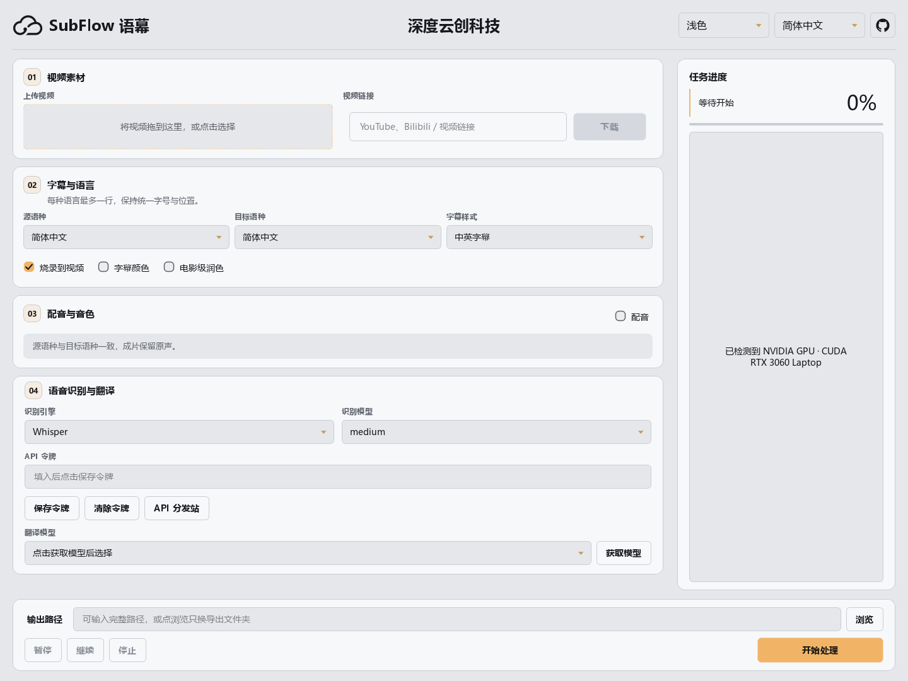

# 新版桌面工作区

适用于 **1.3.60**，截图来自当前真实 Qt 界面与隔离空白配置。

## 三步设置视频

1. **视频素材**：拖入或点击选择本地视频，也可输入链接并下载。长文件名保留首尾，悬停查看完整路径。
2. **字幕与语言**：选择源语种、目标语种和字幕样式，在同一区域选择烧录、字幕颜色和翻译润色。每种语言最多一行，字幕字号和位置保持固定。
3. **配音与音色**：跨语种时直接选择引擎、音色和试听文本。Qwen 标准音色无需参考音频；克隆模式和 GPT-SoVITS 显示所需的参考音频设置。中文源视频选择简体或繁体中文目标时显示保留原声说明。

**语音识别与翻译**始终展开，直接显示 Whisper 引擎、识别模型、API 令牌及翻译模型。缺少必要设置时，客户端滚动并定位到对应输入框。

## 进度与操作

宽窗口右侧显示任务进度和日志，窄窗口自动移到工作区下方。任务信息不会因滚动配置区而消失；配音进度继续显示当前片段、总片段数和已用时间。切换界面语言会翻译当前状态，不会将正在运行或已完成的任务重置为“等待开始”。

底部始终保留输出路径、浏览、暂停、继续、停止与开始按钮。配置区滚动不会移动这些按钮。日志保留最近 5,000 段，避免长任务导致文本控件持续膨胀；任务文件和成片不受影响。

## 小窗口与键盘

- 最低窗口尺寸为 960×640 **逻辑像素**；高 DPI 屏幕按操作系统缩放，配置区可纵向滚动。
- Tab 可聚焦上传区、下拉框、复选框和操作按钮；上传区支持 Enter 或空格选择文件。
- 滚轮在关闭的下拉框上滚动页面，不会意外改变目标语言或音色。点击展开下拉菜单后可正常滚动选项。
- 聚焦控件时完整显示输入框；浅色进度数字使用深色文字，避免浅色背景上的低对比度。
- 新增界面文案覆盖简体中文、繁体中文、英语、日语、西班牙语、俄语、法语、德语。

## 验证范围

使用真实 Qt 控件验证八种界面语言和多种窗口尺寸，覆盖常显设置、输入框定位、音色菜单及底部按钮。本次发布与验收范围见 [1.3.60 发布说明](release-1.3.60.md)。

截图为界面展示，未启动视频处理任务。Apple M 系列 Mac 的实际显示和 GPU 验收仍由用户在实机完成。
